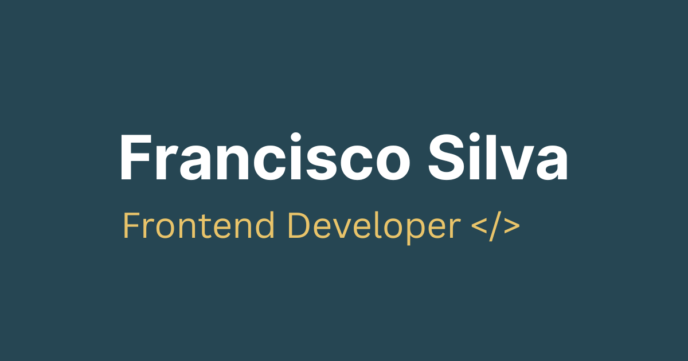

# Francisco Silva - Personal Portfolio

[](https://x1c0.app/)



---

## 🚀 Introduction

Welcome! This repository contains the source code for my personal portfolio website, built to showcase web applications I create for fun and learning. It's designed to highlight projects inspired by real-life use cases and everyday challenges.

This project itself is built using **React**, **Vite**, and **Tailwind CSS** (v4 with CSS variables).

---

## ✨ Features

- **Project Showcase:** Displays project cards with descriptions, tags, images/logos, and links.
- **Responsive Design:** Adapts layout for optimal viewing on desktop, tablet, and mobile devices.
- **Dark/Light Mode:** Includes a theme toggle button with persistence using `localStorage`.
- **Reusable Components:** Built with modular React components for maintainability (e.g., `ProjectCard`, `Intro`, various Icons).
- **Performance:** Utilizes Vite for fast development and optimized production builds.
- **Accessibility:** Includes considerations for semantic HTML, ARIA labels, and contrast ratios (ongoing improvements).

---

## 🛠️ Technologies Used

- **Frontend Library:** React
- **Build Tool:** Vite
- **Styling:** Tailwind CSS v4 (using `@theme` and CSS variables)
- **Icons:** Custom SVG React components
- **Deployment:** GitHub Pages

---

## ⚙️ Getting Started

Follow these instructions to get a copy of the project up and running on your local machine for development purposes.

### Prerequisites

- Node.js (Version 18.x or later recommended)
- npm

### Installation

1.  **Clone the repository:**
    ```bash
    git clone https://github.com/x1c0/my-projects.git
    ```
2.  **Navigate to the project directory:**
    ```bash
    cd my-projects
    ```
3.  **Install dependencies:**
    ```bash
    npm install
    ```

---

## 🏃 Running Locally

To start the development server:

```bash
npm run dev
```
